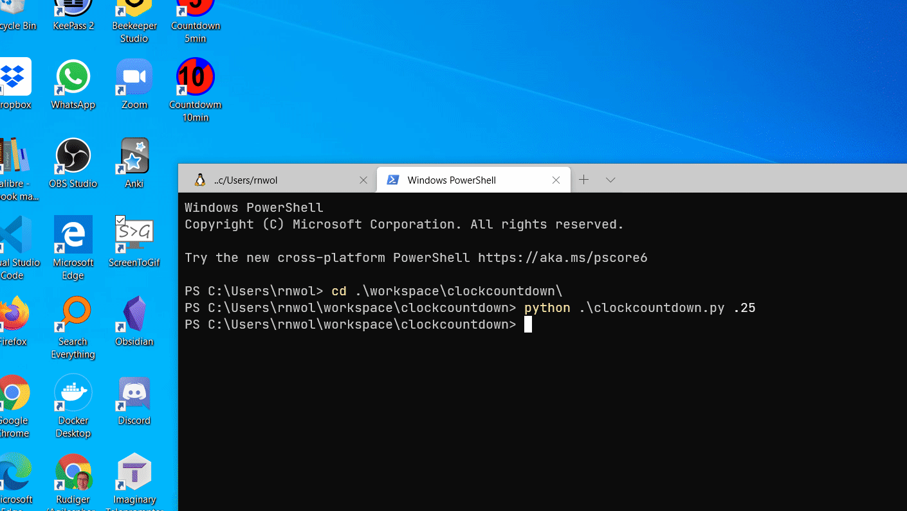

# Countdown Clock

A useful facilitator tool to create a highly visible countdown clock for timeboxing workshop activities. 

This python script should work on most computers with a recent (tested on 3.8 & 3.9) version of python installed.

## Install

Install a recent version of [Python](https://www.python.org/downloads/) and optionally [Git](https://git-scm.com/downloads) version control.

Clone, with git, or dlownload a [zip](https://github.com/rnwolf/clockcountdown/releases) folder with repository files from github and extract to local working directory.

## To Run

Open the local working directory in your terminal command shell. MS-Windows users see this link to open shell [https://www.digitalcitizen.life/open-cmd](https://www.digitalcitizen.life/open-cmd).

In the shell run:
``` python
python clockcountdown.py 5
```
Will launch python and run the script. Countdown will proceed for 5 minutes.

Minimise the countdown app window to pause the clock.



## Tips for quick launching of countdown timers

Create some shortcuts on your desktop to launch python script for 5 min and 10min.

Edit the svg file to create icons for your shortcuts along with https://redketchup.io/icon-editor to create .ico files.


# MIT License

Copyright (c) 2020 Rudiger Wolf  https://rnwolf.net

Permission is hereby granted, free of charge, to any person obtaining a copy
of this software and associated documentation files (the "Software"), to deal
in the Software without restriction, including without limitation the rights
to use, copy, modify, merge, publish, distribute, sublicense, and/or sell
copies of the Software, and to permit persons to whom the Software is
furnished to do so, subject to the following conditions:

The above copyright notice and this permission notice shall be included in all
copies or substantial portions of the Software.

THE SOFTWARE IS PROVIDED "AS IS", WITHOUT WARRANTY OF ANY KIND, EXPRESS OR
IMPLIED, INCLUDING BUT NOT LIMITED TO THE WARRANTIES OF MERCHANTABILITY,
FITNESS FOR A PARTICULAR PURPOSE AND NONINFRINGEMENT. IN NO EVENT SHALL THE
AUTHORS OR COPYRIGHT HOLDERS BE LIABLE FOR ANY CLAIM, DAMAGES OR OTHER
LIABILITY, WHETHER IN AN ACTION OF CONTRACT, TORT OR OTHERWISE, ARISING FROM,
OUT OF OR IN CONNECTION WITH THE SOFTWARE OR THE USE OR OTHER DEALINGS IN THE
SOFTWARE.